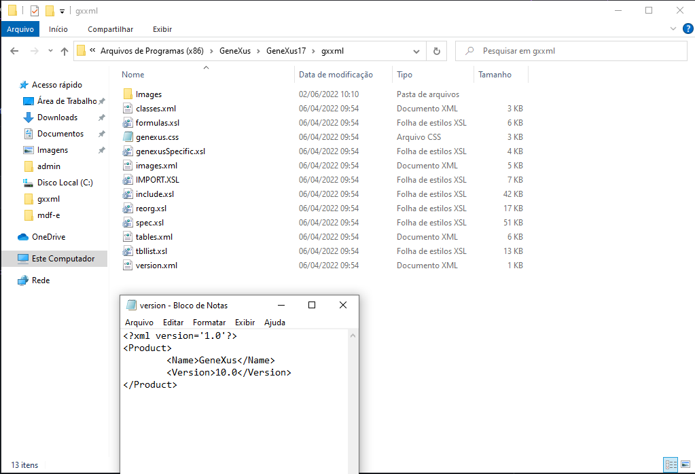
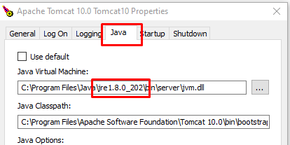
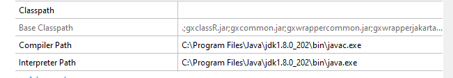

## Genexus-Wiki
 
 
1. Onde verificar versão do Genexus 17?

**localização:** C:\Program Files (x86)\GeneXus\GeneXus17\gxxml  
**arquivo:** version.xml

2. Onde encontrar o guia de arquivos necessários para instalação do Genexus 17?

https://wiki.genexus.com/commwiki/servlet/wiki?30900,GeneXus%2017%20hardware%20and%20software%20requirements

3. Necessário para instalação do Genexus 17:
  - TomCat versão superior a 8 (de preferência a mais atualizada)
  - JDK 8++
  - Instalador Genexus
  
  

POSSIVEIS ERROS:

1. PROJETO NÃO ABRE NO NAVEGADOR:
  - Verificar se a porta utilizada para o serviço já está em uso, utilize no CMD ADMIN o comando: 
    - netstat
    - netstat -a -n -o
    - para eliminar os processos: taskkill /PID <porta>
  - Elimine os serviços da porta, startar novamente o servidor Tomcat e tentar rodar novamente a aplicação
  - CASO NÃO SEJA SOLUCIONADO:
    - reinicie o computador
    - verifique se nas configurações do tomcat o JVM (Java Virtual Machine) se a versão do JRE) utilizada é a mesma que está sendo chamada na versão do JDK no GENEXUS.
    
      
    (imagem referente ao caminho JRE no tomcat)
     
     
    imagem referente ao caminho jdk no genexus)
     
   
2. PROJETO NÃO CONSEGUE SER BUILDADO CRIANDO TABELAS:
  - A solução encontrada foi somente reinstalando o programa
